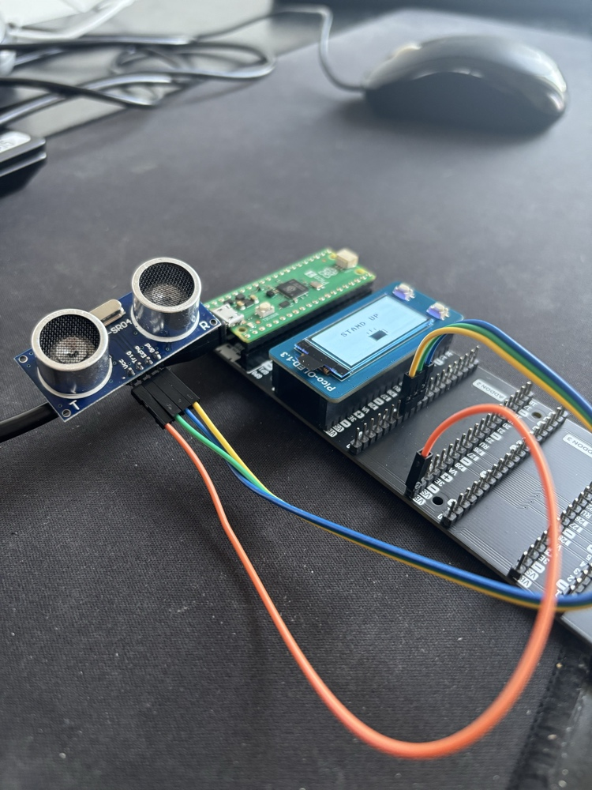

# FocusFlow: Smart Productivity & Wellness Monitor

## 🎯 Project Overview
FocusFlow is a custom IoT device designed to improve physical wellness for desk-based professionals. Built on the **Raspberry Pi Pico 2 (RP2350)** architecture, it uses real-time telemetry to autonomously track sedentary behavior and enforce standing breaks.

Unlike standard timers, FocusFlow uses an ultrasonic rangefinder to detect user presence, creating a frictionless system that pauses when you walk away and alerts you only when you've been sitting too long.

## 🛠 Tech Stack & Hardware
* **Microcontroller:** Raspberry Pi Pico 2 (RP2350) - Dual-core Cortex-M33.
* **Expansion Board:** Pimoroni Pico Decker (Quad-slot expansion).
* **Display:** Waveshare 1.3" OLED (SH1107 Driver) with integrated user buttons.
* **Sensor:** HC-SR04 Ultrasonic Rangefinder.
* **Language:** MicroPython.

## 🧠 Engineering Highlights

### 1. Signal Processing & Data Quality
Raw ultrasonic sensor data is inherently noisy, often resulting in "ghost" movements. I implemented a **Moving Average Filter** (window size = 5) to smooth the signal variance.
* **Result:** The system ignores momentary jitter (like leaning back in a chair) and only registers genuine "Away" states.

### 2. State Machine Architecture
The software is architected as a finite state machine (FSM) to handle conflicting priorities:
* **Monitoring State:** Continuously samples distance and updates the countdown.
* **Alarm State:** Triggers high-contrast visual alerts (Coffee Cup animation) when the threshold is reached.
* **Away State:** Automatically pauses the "Focus Timer" and tracks "Healthy Movement Time" when the user stands up.
* **Moon Mode:** Uses RTC (Real-Time Clock) logic to dim the interface and change messaging after 6:00 PM.

### 3. UX & Gamification
* **Auto-Resume:** No buttons required to start/stop the timer; the sensor handles it.
* **Dashboard:** A dedicated view (toggled via hardware interrupt) displays daily metrics:
    * *Total Away Time* (The key wellness metric).
    * *Session Count* (Productivity blocks completed).

## 🚀 How to Run

1.  **Hardware Setup:**
    * Mount the **OLED HAT** to the Pico Decker.
    * Connect **HC-SR04** Trigger to `GP6` and Echo to `GP7`.
    * Connect **VCC** to `5V (VBUS)` and **GND** to `GND`.

2.  **Software Installation:**
    * Flash the latest **MicroPython** firmware to the Pico 2.
    * Upload `oled.py` (Driver) and `main.py` (Application) to the device.
    * Run `main.py`.

## 📊 Future Roadmap
* **Data Pipeline:** Integration of a Python-based serial logger (`logger.py`) to stream session data to a local CSV for long-term trend analysis (Pandas/Streamlit).
* **Adaptive Thresholds:** Auto-calibrating the "Sitting" distance based on the first 10 seconds of data.
